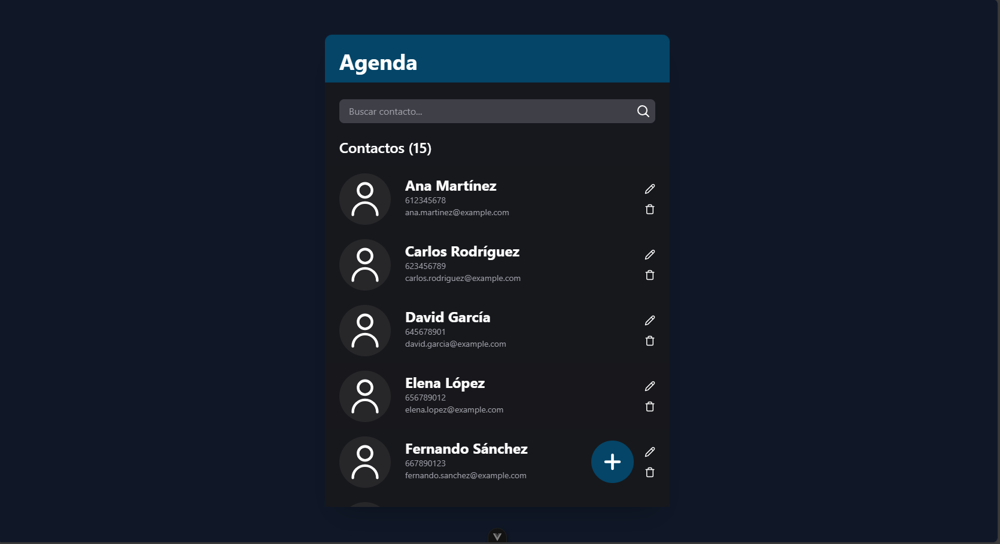
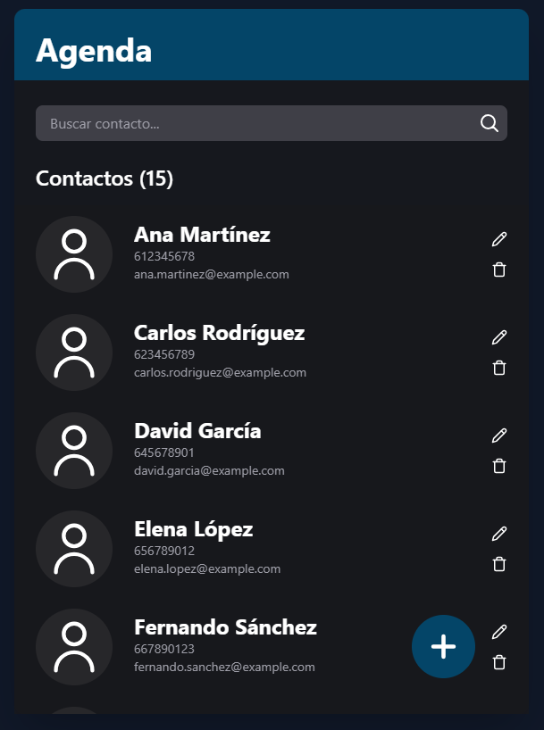
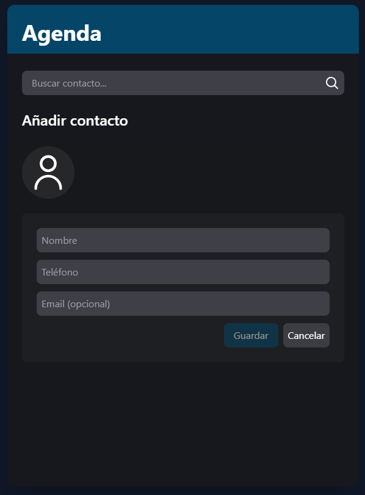
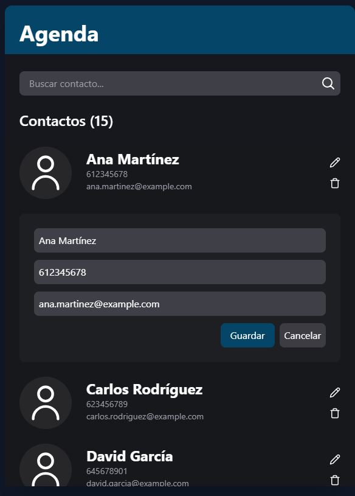
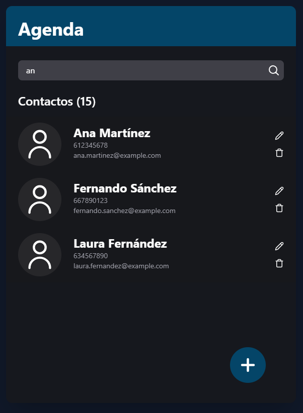
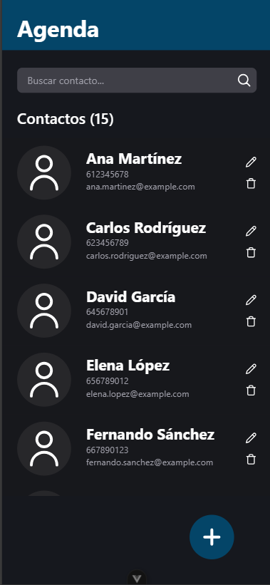

# Agenda de Contactos Vue.js

Una aplicación moderna de gestión de contactos desarrollada con Vue.js y Tailwind CSS. Esta aplicación permite almacenar, buscar, editar y eliminar contactos de manera intuitiva y con una interfaz atractiva.

<div>
<p style = 'text-align:center;'>

</p>
</div>

## Características

- ✅ **Gestión de contactos**: Añadir, editar y eliminar contactos
- 🔍 **Búsqueda en tiempo real**: Filtra contactos mientras escribes
- 💾 **Persistencia de datos**: Los contactos se guardan en localStorage
- 🎨 **Diseño responsive**: Funciona en dispositivos móviles y de escritorio
- ✨ **Animaciones fluidas**: Transiciones suaves para una mejor experiencia de usuario
- 🌙 **Tema oscuro**: Interfaz elegante y moderna

## Tecnologías utilizadas

- **Vue.js 3**: Framework progresivo para construir interfaces de usuario
- **TypeScript**: Superset de JavaScript con tipado estático
- **Tailwind CSS**: Framework de CSS utilitario para diseño rápido
- **Vite**: Herramienta de construcción frontend ultrarrápida
- **Vue Composition API**: Para una mejor organización del código
- **LocalStorage API**: Para persistencia de datos en el navegador

## Capturas de pantalla

### Vista principal con lista de contactos



### Añadiendo un nuevo contacto



### Editando un contacto existente



### Búsqueda de contactos



### Vista mobile



## Instalación

### Requisitos previos

- Node.js (v14 o superior)
- pnpm (v7 o superior)

### Pasos para instalar

1. Clona el repositorio:

```bash
git clone https://github.com/jmruirod/contacts-list
cd contacts-list
```

2. Instala las dependencias:

```bash
pnpm install
```

3. Inicia el servidor de desarrollo:

```bash
pnpm dev
```

4. Abre tu navegador en `http://localhost:5173`

## Construcción para producción

Para construir la aplicación para producción:

```bash
pnpm build
```

Los archivos compilados se guardarán en el directorio `dist/`.

## Estructura del proyecto

```
/
├── public/            # Archivos estáticos
├── src/
│   ├── components/    # Componentes Vue
│   │   ├── ContactList.vue      # Lista de contactos
│   │   ├── ContactCard.vue      # Tarjeta de contacto individual
│   │   ├── ContactForm.vue      # Formulario para añadir/editar contactos
│   │   ├── SearchBar.vue        # Barra de búsqueda
│   │   └── icons/               # Componentes de iconos
│   ├── store/         # Gestión del estado
│   │   └── contactListStore.ts  # Store para los contactos
│   ├── App.vue        # Componente raíz
│   └── main.ts        # Punto de entrada
├── index.html         # Plantilla HTML
├── package.json       # Dependencias y scripts
├── tailwind.config.js # Configuración de Tailwind CSS
├── tsconfig.json      # Configuración de TypeScript
└── vite.config.ts     # Configuración de Vite
```

## Uso

### Añadir un contacto

1. Haz clic en el botón con el símbolo "+" en la esquina inferior derecha.
2. Completa los campos del formulario (nombre, teléfono, email).
3. Haz clic en "Guardar".

### Editar un contacto

1. Haz clic en el icono de lápiz junto al contacto que deseas editar.
2. Modifica los campos necesarios.
3. Haz clic en "Guardar".

### Eliminar un contacto

1. Haz clic en el icono de papelera junto al contacto que deseas eliminar.
2. El contacto se eliminará inmediatamente.

### Buscar contactos

1. Escribe en la barra de búsqueda en la parte superior.
2. Los contactos se filtrarán automáticamente según tu entrada.

## Características de accesibilidad

- Contraste de colores adecuado para una mejor legibilidad
- Navegación con teclado
- Mensajes de retroalimentación visual cuando se realizan acciones
- Indicadores de carga durante operaciones

## Desarrollado con ❤️ por

- Jose Manuel Ruiz Rodríguez - [GitHub](https://github.com/jmruirod)

## Licencia

Este proyecto está licenciado bajo la Licencia MIT
